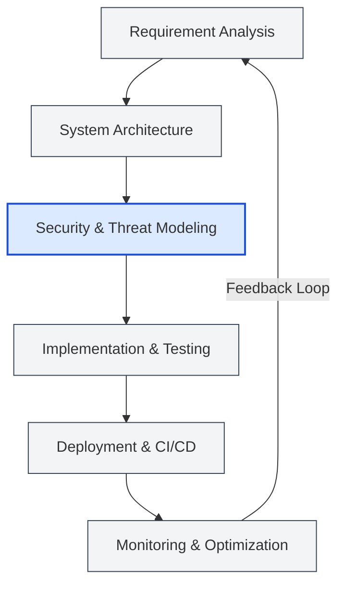

  

 

  
<em>Engineering secure, scalable, and intelligent systems with a focus on clean architecture and robust developer experience.</em>

## 🎯 Engineering Focus
My work primarily intersects **Artificial Intelligence** and **Cybersecurity**, building production-grade solutions that solve complex problems securely and efficiently. I advocate for comprehensive testing, strong architectural patterns, and automation.

## 🚀 Featured Engineering Work

### [Q-Sentra](https://github.com/YeshwanthRajSelvaraj/Q-Sentra_PNB)
**AI-driven quantum-safe cryptographic discovery and risk orchestration platform.** Identifies vulnerable encryption across infrastructure, predicts post-quantum threats, and automates PQC migration with blockchain-backed certification.

### [Virtual Interview Proctor](https://github.com/YeshwanthRajSelvaraj/Virtual-Interview-Proctor)
**AI-powered video interview proctoring system.** Ensures fairness and integrity in remote hiring using computer vision and behavioral analysis to monitor candidates and detect anomalies securely.

### [Cloud IAM Forensics Framework](https://github.com/YeshwanthRajSelvaraj/cloud-iam-forensics-framework-cyberforensic)
**Forensic investigation framework.** Detects IAM misconfigurations, analyzes cloud access patterns, and generates tamper-proof security intelligence across multi-cloud environments.

### [AI Voice Cloning TTS System](https://github.com/YeshwanthRajSelvaraj/AI-Voice-Cloning-TTS-System)
**Deep learning-based Text-to-Speech.** Built using Coqui TTS, enabling realistic speech synthesis and speaker voice replication from input audio samples.

---

## 🛠️ Technical Stack & Capabilities

| Domain | Technologies & Frameworks |
|:---|:---|
| **Programming** | Python, TypeScript, JavaScript, Java, C |
| **AI & Machine Learning** | TensorFlow, Keras, Coqui TTS, Computer Vision, NLP |
| **Cloud & Security** | AWS, Cloud IAM Forensics, Network Forensics, VAPT |
| **Web Architecture** | Next.js, React, Node.js, Express, HTML5, CSS3/Tailwind |
| **Infrastructure** | Docker, Kubernetes, CI/CD Pipelines |

---

## 🏗️ Architecture & System Design Philosophy

   
  <i>Always building with authenticity, security, and maintainability in mind.</i>

